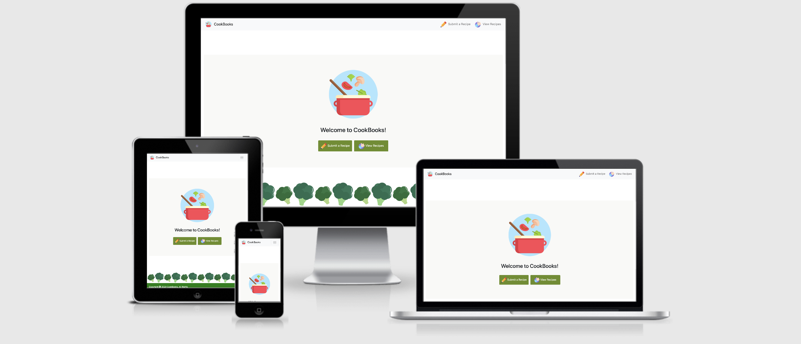
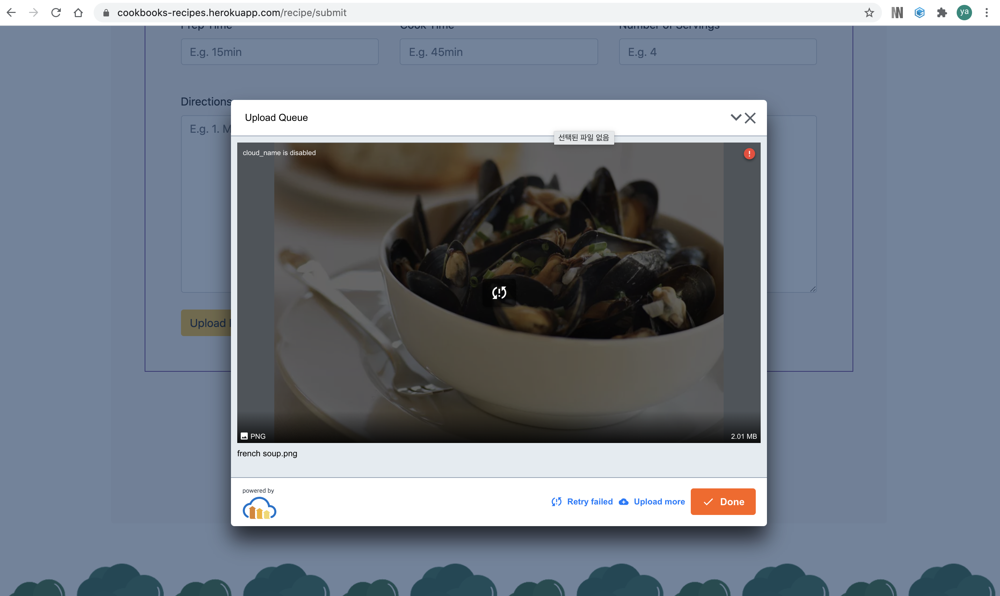

# Python and Data Centric Development
### Welcome to CookBooks

[Cookbooks](https://cookbooks-recipes.herokuapp.com/)<br>
[My Github Page](https://github.com/suchan5/Project-3)

This website is designed and developed for users who are interested in cooknig.

It enables the users to share their own cook recipes with the community, and benefit from having convenient access to the data provided by all other users.

It comprises of two main sections which are to submit their recipes and to view those receipes submitted.<br>
Users also can view all other recipes submitted by other users and are able to freely access to add comments, or to edit or delete. (No authetication required).


# Technologies used
* HTML5 - it was used to build the structure of the website.
* CSS3 - it was used to give design effects and style to the website. Also, media query was used for responsive design purpose.
* JavaScript - it was used to make the website more dynamic and interactive.
* Python + Flask - Python was used to build the database-backed Flask web application.
* [MongoDB](https://www.mongodb.com) - non-relational database was used for designing a database structure, and data was stored in MongoDB Atlas (Cloud)
* [jQuery 3.5.0](https://jquery.com) - it was used to make it easier to use JavaScript.
* [Bootstrap 4.4](https://getbootstrap.com) - it was used for structure and style for the website with responsive design for different media sizes.
* [Font Awesome](https://fontawesome.com) - it was used for concise and intuitive design effect with using icons.
* [Cloudinary](https://cloudinary.com/) - it was used for image uploading function
* [DISQUS](https) - it was used for commenting function

# Structure
[Wireframe](#)
#### Each pages are interactive and intuitive that it makes it easier for users to explore the contents throught out the website.
* 'Home' page is the first page that users see when they access to the domain address. Big logo of the website are located in the centre with the two big buttons('Submit a Recipe' and 'View Recipes') to let users get the idea immediately of what this website is built for.
* 'Submit a Recipe' page is consist of a form. Users can fill up the blank with relevant information such as ingredients, in order to share their recipes. Also, images can be uploaded it they want to.
* 'Board View' page' is where users can view the recipe they have just submitted. Upon submission, it directly link to this board view for users to check and view the recipe they have just created.
* 'View Recipes' page is showing all recipes availble in the website. Users can search any recipes with search terms or can view recipes by cuisines.
* 'Edit' page is where users can edit or update the recipes. No authentication reuired. Anyone can access to the recipe simply by clicking the recipe and click edit button to update the selected recipe.
* 'Delete' page is where users can delte the recipes. Upon clicking the delete button, confirmation aleart will appear to double check if they want to proceed to delete.


# UI/UX Design
This website is created with a focus on UI/UX that is:
1. Simple & clear :
- This is achieved by giving consistency in visual style throughout the website. Also, I give enough spacing(padding and margin) for better readability of the contents.

2. Easy to use :
- Responsiveness : For example, font-size was responsive to different device sizes so that users can use the website even on the smaller size of thier devices.
- Placeholder, icons, buttons, flash messages are added to guide users.

3. Presentable :
- Clean and theme-related image(brocoli) was chosen for the backgroud and placed at the bottom to boost users' interests.
- To give the texts a better visibility over the white background, I have added a translucent grey box so that the contents are more readable.
- Images are not pixelated and uniform in size on different media sizes.
- For fonts, black and dark gray were chosen as two main colours in order to give consistency in design effect.
- Preview of images of recipes are availale on 'View Recipes' page for intuitive design.

## Features and functions added for improved UI/UX

#### Navbar : 
- A navbar is added on the top of the website for users' direct access to each sections. 
- Navbar shows the twn main functions (Submit and View) so that user can create or read their recipes at anytime.
- Navbar is accessible from every page.

#### Giving guidance:
- Upon creation, updating and deleting of the recipes, flash message appears to indicate that the event are performed succesfully (Flash messages disaapear after some time).
- Used placeholder to give users an idea what to fill in in the blank in the submission form.

#### Preview of images:
- When submitting or updating the recipe, users can view the priview of images that they are going to post/edit.
- Users can also view the uploaded file name to ensure before submitting that the files is the correct file which they would like to post.

#### Search function :
- Users can search for the recipes with search terms.
- Users can search with the search terms irrelevant to the use of upper case or lower case.
- Results will be shown even when the search term is in full or partial (Both full and partion terms are detectable).

#### View by categories:
- Users can view all the availble recipes in the website by cuisines.

#### Recipes can be enlarged :
- For 'View Recipes' page, all the recipes whih are displayed in the form of card can be enlarged for easier readability upon mouse hover.

#### Button colours
- Button colours are changed on hover
- Different colors used on different buttons but at the same time, chosen same color for the buttons with same function for intuitive design effect.
(e.g. 'Save' buttons across templates are in blue, 'Cancel' buttons across templates are in black.)

#### Mouse cursor is changed to pointer on click-able buttons

#### Commenting function added
- Users can freely leave a comment on the recipe to share opinion with other users. (Acheived by using DISQUS)

#### Redirect:
- Users are redirected to the same page where they left of. (For example, User views a recipe from page 2, when user clicks 'go to list', he/she will be redirected back to page 2)

#### Pagination:
- For 'View Recipes' page, each page is designed to display 12 cards (4 by 3 per page). When cards exceed twelve, it will automatically create a new next page. 
- Each blocks contain 5 pages. When page exceeded five, users can simply click the 'Next' button to view the next block.

# Responsive Design
The main purpose of the test on the responsive design is to ensure that the website works well and looked organized in different sizes of the media. It was acheived by using Bootstrap, media query, and 'Inspect' function from Google Chrome.




# Deployment 
Cookbooks is deployed using a cloud based hosing paltform, Heroku.

#### Errors & differences detected 
There is an error detected which does not occur in Gitpod.
###### Cloudinary is not working for uploading images.



There is no issue noted when uploading a photo of a recipe from Gitpod. Whereas in the deployed website, the photo cannot be uploaded by the Cloudinary. <br>
I have enquired about the issue with Cloudinary and they suggested a code as below to try which did not resolve the issue. 
```html
<button id="upload_widget" class="cloudinary-button">Upload files</button>

<script src="https://widget.cloudinary.com/v2.0/global/all.js" type="text/javascript"></script>  

<script type="text/javascript">  
var myWidget = cloudinary.createUploadWidget({
  cloudName: 'dj7poh6mc', 
  uploadPreset: 'jvn95k4g'}, (error, result) => { 
    if (!error && result && result.event === "success") { 
      console.log('Done! Here is the image info: ', result.info); 
    }
  }
)

document.getElementById("upload_widget").addEventListener("click", function(){
    myWidget.open();
  }, false);
</script>
```
The issue still remains unsolved.

# Testing
* To ensure that there are no broken images or links.
* To ensure that the website is responsive on different devices.
* To ensure that the website runs well on different browsers.

I sent the deployed URL to friends and family to test whether the website works responsively without broken images or links in different screen sizes. Also, tests was done on different browsers to ensure that the website works well.
##### Devices tested 
* Oppo R11
* iPhone XR
* iPhone 6S
* Galaxy S20+
* Galaxy Tab A
* MacBook Pro
* iPad Air 3 rd Gen 
* HanSung Computer Ultron 2454C

##### Browsers tested 
* Google Chrome 
* Safari 
* Firefox 
* Internet Exporer 

##### No error detected. Testing results are as expected.


## Credit

#### Images
* [Flaticon](https://www.flaticon.com/free-icon/) - for the imoticons used in navbar and logo
* [ac-illust](https://ac-illust.com/ko/) - for the brocoli image used in backgroud

#### Recipes
*
[Kim's Cravings](https://www.kimscravings.com/)
[Google Image](https://www.google.com/search?q=%ED%81%B4%EB%9E%A8+%EC%B0%A8%EC%9A%B0%EB%8D%94+%EB%A7%8C%EB%93%A4%EA%B8%B0&tbm=isch&ved=2ahUKEwjVl5mejtXqAhWbnksFHbsKAjcQ2-cCegQIABAA&oq=%ED%81%B4%EB%9E%A8+%EC%B0%A8%EC%9A%B0%EB%8D%94+%EB%A7%8C%EB%93%A4%EA%B8%B0&gs_lcp=CgNpbWcQAzoECCMQJzoCCAA6BggAEAUQHjoHCCMQ6gIQJzoECAAQGDoECAAQHlDI0gFYnvkBYNL6AWgHcAB4AIABkAGIAZgKkgEEMzAuMZgBAKABAaoBC2d3cy13aXotaW1nsAEKwAEB&sclient=img&ei=FAgSX9W9DJu9rtoPu5WIuAM&bih=821&biw=1440&rlz=1C5CHFA_enSG893SG895#imgrc=A50LdUlQ4naizM)
[Xiachufang](https://www.xiachufang.com/)
[Good Chef Bad Chef](https://www.goodchefbadchef.com.au/)
[California Avocado](https://www.californiaavocado.com/recipes/recipe-container/california-avocado-chicken-burrito)
[My Korean Kitchen](https://mykoreankitchen.com/)
[China Sichuan Food](https://www.chinasichuanfood.com/)
[Delicious.](https://www.delicious.com.au/)
[McCormick](https://www.mccormick.com/)
[The Spruce Eats](https://www.thespruceeats.com/)
[Damn Delicious](https://damndelicious.net/)


#### Ackowledgement
* [W3schools](https://www.w3schools.com/css/css3_buttons.asp) - for the 'Submit a Recipe' and 'All Recipes' button used in 'Home' page
* [W3schools](https://www.w3schools.com/css/tryit.asp?filename=trycss_ex_pagination_transition) - for the CSS design effects used in pagination
* [Inflearn](https://www.inflearn.com/) - for the reference tutorial for pagination
* [Yahya Elharony](https://www.elharony.com/remove-disqus-footer-also-on-sections-using-css/#:~:text=How%20to%20remove%20Disqus%20Footer,uncheck%20it%20if%20you%20want.) - for the CSS design effects to make footer of DISQUS not shown
